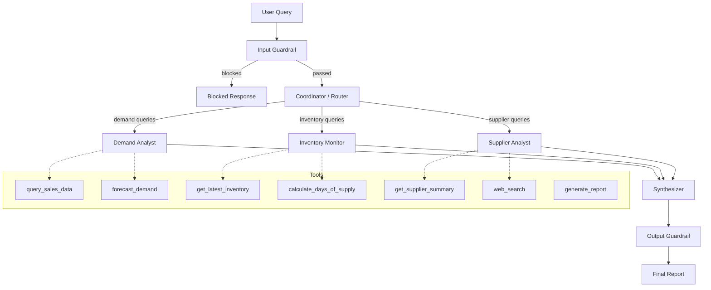
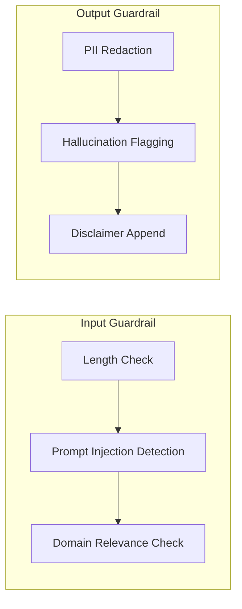
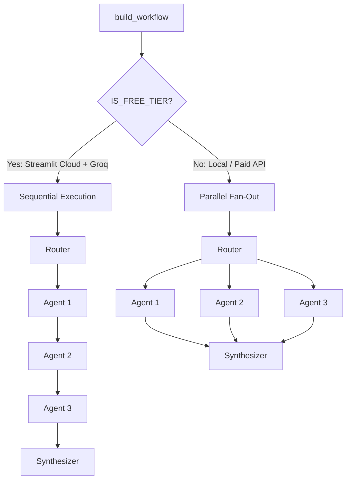
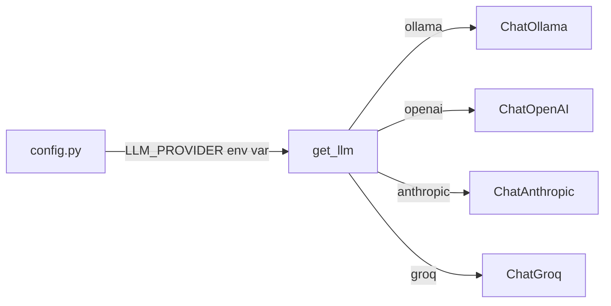
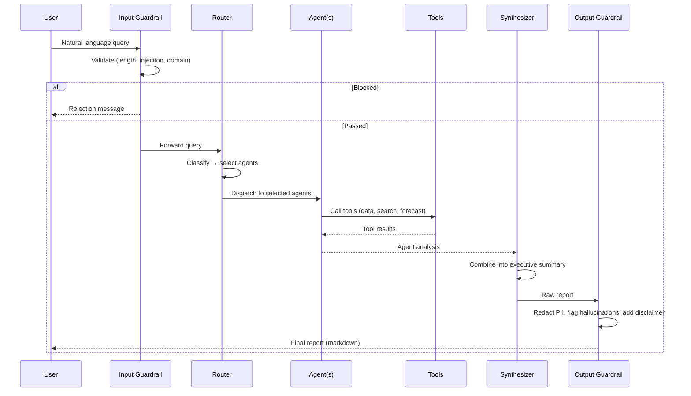

# Architecture

## System Overview

Supply Chain Intelligence Agents (SCIA) is a multi-agent system built with LangGraph that analyzes CPG supply chain data using specialized AI agents. It includes input/output guardrails and adapts its execution strategy based on the deployment environment.

## Full Pipeline

## Guardrails

**Input guardrails** run before any LLM call, saving cost on invalid queries:
- **Domain relevance**: Keyword-based check ensures queries relate to supply chain topics
- **Prompt injection**: Regex patterns detect common injection techniques (e.g., "ignore previous instructions")
- **Length limit**: Rejects queries over 1000 characters

**Output guardrails** sanitize agent responses before returning to the user:
- **PII redaction**: SSNs, credit card numbers, email addresses, API keys/credentials
- **Hallucination flagging**: Detects hedging language and appends a warning
- **Disclaimer**: Every response includes a note about sample data and AI-generated insights

## Design Pattern: Supervisor with Conditional Fan-Out

The system uses LangGraph's **supervisor pattern**:

1. **Input Guardrail Node**: Validates the query; blocks or passes through
2. **Router Node**: An LLM classifies the user query and selects which specialist agents to invoke
3. **Agent Nodes**: Each specialist runs as a ReAct agent with its own tool set
4. **Synthesizer Node**: Combines all agent outputs into a unified executive summary
5. **Output Guardrail Node**: Sanitizes and validates the final response

This pattern allows:
- **Selective execution**: Only relevant agents run for each query
- **Parallel capability**: Independent agents can execute concurrently (local mode)
- **Composability**: New agents can be added by defining tools + prompt + node
- **Safety**: Guardrails wrap the entire pipeline without modifying agent logic

## Execution Modes

The system adapts its execution strategy based on the deployment environment:

| Environment | Agent Execution | Rate Limit Handling |
|-------------|----------------|---------------------|
| Local (Ollama) | Parallel fan-out | None needed |
| Streamlit Cloud + Groq free tier | Sequential with retry | Exponential backoff (30s, 60s, 120s) |
| Any environment + paid API | Parallel fan-out | None needed |

**Detection**: Streamlit Cloud is detected by the presence of `/mount/src`. Free tier is flagged when `IS_STREAMLIT_CLOUD` is true and `LLM_PROVIDER` is `groq`.

## LLM Provider Abstraction

## Data Flow

## Key Design Decisions

| Decision | Choice | Rationale |
|----------|--------|-----------|
| Orchestration | LangGraph StateGraph | Type-safe state, conditional routing, built-in persistence support |
| Agent type | ReAct (create_react_agent) | Reasoning + acting loop, well-suited for tool-use tasks |
| Routing | LLM-based classification | Flexible, handles ambiguous queries, easy to extend |
| Guardrails | Custom rule-based (no LLM) | Zero latency and cost for input validation; deterministic output sanitization |
| Execution mode | Environment-aware | Parallel locally for speed, sequential on free-tier cloud to respect rate limits |
| Data layer | Pandas + CSV | Simple for demo; swappable for database in production |
| LLM provider | Configurable via env | Supports local (Ollama), free cloud (Groq), and paid (OpenAI/Anthropic) |
