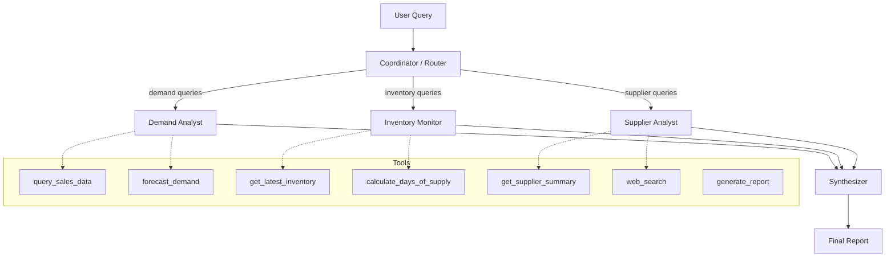
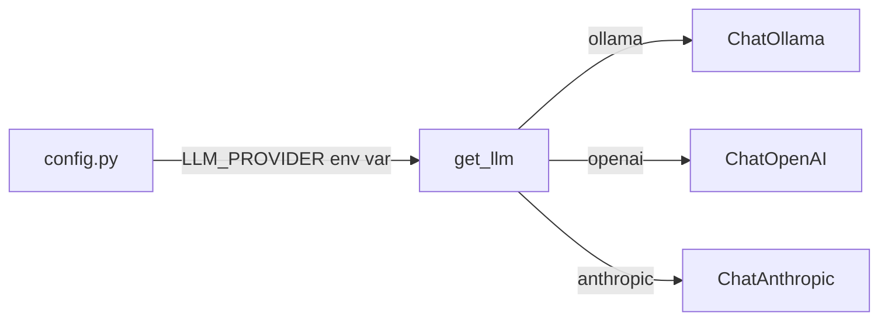
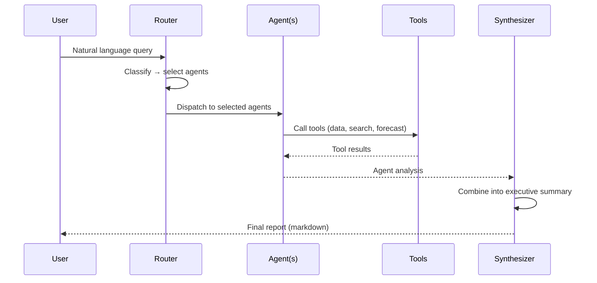

# Architecture

## System Overview

Supply Chain Intelligence Agents (SCIA) is a multi-agent system built with LangGraph that analyzes CPG supply chain data using specialized AI agents.

## Agent Architecture

## Design Pattern: Supervisor with Conditional Fan-Out

The system uses LangGraph's **supervisor pattern**:

1. **Router Node**: An LLM classifies the user query and selects which specialist agents to invoke
2. **Agent Nodes**: Each specialist runs as a ReAct agent with its own tool set
3. **Synthesizer Node**: Combines all agent outputs into a unified executive summary

This pattern allows:
- **Selective execution**: Only relevant agents run for each query
- **Parallel capability**: Independent agents can execute concurrently
- **Composability**: New agents can be added by defining tools + prompt + node

## LLM Provider Abstraction

## Data Flow

## Key Design Decisions

| Decision | Choice | Rationale |
|----------|--------|-----------|
| Orchestration | LangGraph StateGraph | Type-safe state, conditional routing, built-in persistence support |
| Agent type | ReAct (create_react_agent) | Reasoning + acting loop, well-suited for tool-use tasks |
| Routing | LLM-based classification | Flexible, handles ambiguous queries, easy to extend |
| Data layer | Pandas + CSV | Simple for demo; swappable for database in production |
| LLM provider | Configurable via env | Supports local (Ollama) and cloud (OpenAI/Anthropic) |
